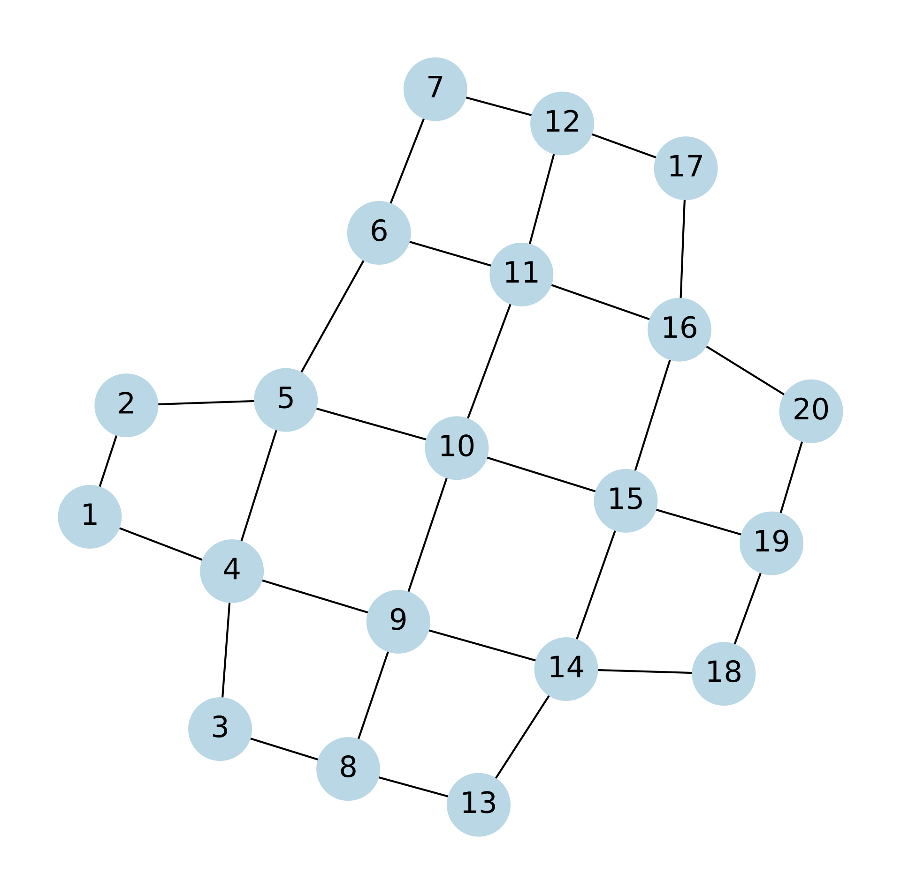

.. _tutorials:

Using Braket Client
-------------------

.. _register_account:

Registering for an AWS Account
^^^^^^^^^^^^^^^^^^^^^^^^^^^^^^

The usage of the Amazon Braket LocalSimulator does not require an account. However, to use Amazon Braket devices such as the statevector simulator and hardware, the user needs to register for an account here: https://signin.aws.amazon.com/signup?request_type=register.

The user also needs to ensure the prerequisites have been configured. More information can be found here: https://github.com/amazon-braket/amazon-braket-sdk-python#prerequisites.

.. _execute_a_circuit:

Submit a circuit
^^^^^^^^^^^^^^^^

In this example, we will demonstrate how to submit a Qibo circuit onto an Amazon Braket device. We will use IQM Garnet as an example. Note that by default `verbatim_circuit=False`, therefore the transpilation of the input circuit and assignment of the best qubits to use will be left to the device.

To use BraketClientBackend, we import `BraketClientBackend` from `qibo_cloud_backends.braket_client`:

.. code-block:: python

   from qibo_cloud_backend.braket_client import BraketClientBackend

Then, construct a Qibo circuit.

.. code-block:: python

   from qibo import gates, Circuit as QiboCircuit

   c = QiboCircuit(2)
   c.add(gates.H(0))
   c.add(gates.CNOT(0, 1))
   c.add(gates.M(0))
   c.add(gates.M(1))

   print(c.draw())

We should get this circuit:

.. code-block:: python

   q0: -H-o-M-
   q1: ---x-M-

Now, we initialize a Amazon Braket device (e.g. IQM Garnet) and execute circuit `c` on the backend `AWS`.

.. code-block:: python

   device = "arn:aws:braket:eu-north-1::device/qpu/iqm/Garnet"
   AWS = BraketClientBackend(device = device, verbatim_circuit=False)

   counts = AWS.execute_circuit(c, nshots=1000).frequencies()
   print(counts)

Alternatively, one can also use the LocalSimulator to execute circuit `c`. This can be done by leaving `device` empty as it defaults to the LocalSimulator.

.. code-block:: python

   AWS = BraketClientBackend(verbatim_circuit=False)

   counts = AWS.execute_circuit(c, nshots=1000).frequencies()
   print(counts)

To monitor the status of a circuit that is executed, especially on an Amazon Braket device, one can set `verbosity=True`. By default, `verbosity=False`.

.. code-block:: python

   device = "arn:aws:braket:eu-north-1::device/qpu/iqm/Garnet"
   AWS = BraketClientBackend(device = device, verbatim_circuit=False, verbosity=True)

   counts = AWS.execute_circuit(c, nshots=1000).frequencies()
   print(counts)

One can also use the density matrix local simulator by specifying `device = "local_simulator:braket_dm"`.

.. _execute_in_verbatim_mode:

Submit a circuit in verbatim mode
^^^^^^^^^^^^^^^^^^^^^^^^^^^^^^^^^

In verbatim mode, the circuit is executed on the device without any transpilation. The user has to ensure that the circuit is specifically written in the device's native gates and gates respect the topology of the device.
Therefore, before submitting a Qibo circuit in verbatim mode, it is recommended to extract the Amazon Braket device's information. We will demonstrate this below.

.. _Amazon_Braket_parameters:

Extracting Amazon Braket device parameters
~~~~~~~~~~~~~~~~~~~~~~~~~~~~~~~~~~~~~~~~~~

The Amazon Braket devices can be found here: https://aws.amazon.com/braket/quantum-computers/. Using the `IQM Garnet device <https://aws.amazon.com/braket/quantum-computers/iqm/>`_ as an example, we demonstrate how to extract useful device information such as the qubit topology and native gates. The qubit connectivity on the IQM Garnet device can be visualised using `NetworkX <https://networkx.org/>`_.

.. code-block:: python

   import networkx as nx

   device = "arn:aws:braket:eu-north-1::device/qpu/iqm/Garnet"
   connectivity_graph = AwsDevice(device).properties.paradigm.connectivity.connectivityGraph
   native_gates = AwsDevice(device).properties.paradigm.nativeGateSet
   print(native_gates)

   G = nx.Graph()
   for node, neighbors in connectivity_graph.items():
      for neighbor in neighbors:
         G.add_edge(node, neighbor)

   nx.draw(G, pos=nx.spring_layout(G), with_labels=True, node_color='lightblue', node_size=500, font_size=10, font_weight='bold', edge_color='gray')

Submit the circuit
~~~~~~~~~~~~~~~~~~

Let us run a circuit with `verbatim_circuit=True` on an Amazon Braket device, using IQM Garnet as an example. When `verbatim_circuit=True`, the circuit is submitted as is onto the Amazon Braket device. The device expects to receive a circuit composed of its native gates only and with entangling gates that respect its connectivity (entangling gates can be executed only on qubit pairs that are physically connected on the chip). For IQM Garnet, for instance, the native gates are `CZ` and `PRX` and the connectivity is a square lattice of 20 qubits.

.. code-block:: python

   from qibo import gates, Circuit as QiboCircuit
   import numpy as np

   c = QiboCircuit(5)
   c.add(gates.PRX(1, 0.5*np.pi, 1.5*np.pi))
   c.add(gates.PRX(4, 0.142857142857143*np.pi, 0))
   c.add(gates.CZ(4, 1))
   c.add(gates.PRX(1, 0.5*np.pi, 0.5*np.pi))
   c.add(gates.M(1))
   c.add(gates.M(4))

   print(c.draw())

We should get this circuit:

.. code-block:: python

   q0: -------------
   q1: -prx-Z-prx-M-
   q2: -----|-------
   q3: -----|-------
   q4: -prx-o-M-----

Since IQM Garnet has qubits indexed from 1 to 20, we will intentionally leave qubit `q0` empty without any gates. An error will be raised if there are gates on any qubits not in the range from 1 to 20.

Now, we initialize the `BraketClientBackend` with the `Garnet` device and execute the circuit `c` with it.

.. code-block:: python

   device = "arn:aws:braket:eu-north-1::device/qpu/iqm/Garnet"
   AWS = BraketClientBackend(device = device, verbatim_circuit=True)

   counts = AWS.execute_circuit(c, nshots=1000).frequencies()
   print(counts)

.. _ZNE_example:

Example: Using Zero Noise Extrapolation
^^^^^^^^^^^^^^^^^^^^^^^^^^^^^^^^^^^^^^^

In this example, we illustrate the use of Zero Noise Extrapolation (ZNE) to improve the results of a Quantum Approximate Optimization Algorithm (QAOA) circuit. The circuit solves a trivial MaxCut problem with a single QAOA layer. We just need to set up Qibo's `ZNE <https://qibo.science/qibo/stable/api-reference/qibo.html#zero-noise-extrapolation-zne>`_ routine with our initialized `BraketClientBackend`.

Here, we make several assumptions:

1. The user is able to transpile any Qibo circuit to IQM Garnet's native gates and to fit IQM Garnet's qubit topology.

2. The optimal angles for the single QAOA layer are known.

With these assumptions met, we then transpile the QAOA circuit that looks like this

.. code-block:: python

   q0: -H-o----o-o----o-o----o---------------RX-M-
   q1: -H-X-RZ-X-|----|-|----|-o----o--------RX-M-
   q2: -H--------X-RZ-X-|----|-X-RZ-X-o----o-RX-M-
   q3: -H---------------X-RZ-X--------X-RZ-X-RX-M-

to the following circuit `c` written in IQM Garnet's native gates, targeting specific qubits that respect the topology shown in :ref:`IQM_Garnet_topology`. The optimal parameters for the `RZ` and `RX` gates are not shown in this circuit above.

The topology was obtained using the code in the section :ref:`Amazon_Braket_parameters`. The parameters for the `PRX` gates are optimal. We select `verbatim_circuit=True` as we do not want the device to transpile the circuit.

.. _IQM_Garnet_topology:

   Figure 1: IQM Garnet topology.

Writing the transpiled circuit `c` in full, we have:

.. code-block:: python

   c = QiboCircuit(10):
   c.add(gates.PRX(3, -np.pi, np.pi/2))
   c.add(gates.PRX(3, np.pi, -np.pi/2))
   c.add(gates.PRX(4, np.pi/2, np.pi/2))
   c.add(gates.PRX(4, np.pi, 0))
   c.add(gates.CZ(3, 4))
   c.add(gates.PRX(3, -1.081592653589793, 0))
   c.add(gates.PRX(3, np.pi, -np.pi))
   c.add(gates.CZ(3, 4))
   c.add(gates.PRX(3, np.pi/2, np.pi/2))
   c.add(gates.PRX(3, np.pi, 0))
   c.add(gates.PRX(5, -np.pi, np.pi/2))
   c.add(gates.PRX(5, np.pi, -np.pi/2))
   c.add(gates.PRX(9, -np.pi, np.pi/2))
   c.add(gates.PRX(9, np.pi, -np.pi/2))
   c.add(gates.CZ(4, 9))
   c.add(gates.PRX(9, -1.081592653589793, 0))
   c.add(gates.PRX(9, np.pi, -np.pi))
   c.add(gates.CZ(4, 9))
   c.add(gates.CZ(4, 5))
   c.add(gates.PRX(5, -1.081592653589793, 0))
   c.add(gates.PRX(5, np.pi, -np.pi))
   c.add(gates.CZ(4, 5))
   c.add(gates.PRX(4, 2.850796326794897, 0))
   c.add(gates.PRX(5, -np.pi, np.pi/2))
   c.add(gates.PRX(5, np.pi, -np.pi/2))
   c.add(gates.PRX(9, -np.pi/2, -np.pi))
   c.add(gates.PRX(9, np.pi, -np.pi/4))
   c.add(gates.CZ(4, 9))
   c.add(gates.PRX(4, np.pi/2, 0))
   c.add(gates.PRX(9, np.pi/2, 0))
   c.add(gates.CZ(4, 9))
   c.add(gates.PRX(4, np.pi/2, 0))
   c.add(gates.PRX(9, np.pi/2, 0))
   c.add(gates.CZ(4, 9))
   c.add(gates.PRX(4, np.pi/2, np.pi/2))
   c.add(gates.PRX(4, np.pi, 0))
   c.add(gates.CZ(3, 4))
   c.add(gates.PRX(4, -1.081592653589793, 0))
   c.add(gates.PRX(4, np.pi, -np.pi))
   c.add(gates.CZ(3, 4))
   c.add(gates.PRX(3, 1.28, 0))
   c.add(gates.PRX(4, np.pi/2, np.pi/2))
   c.add(gates.PRX(4, np.pi, 0))
   c.add(gates.CZ(4, 5))
   c.add(gates.PRX(4, -1.081592653589793, 0))
   c.add(gates.PRX(4, np.pi, -np.pi))
   c.add(gates.CZ(4, 5))
   c.add(gates.PRX(4, 1.28, 0))
   c.add(gates.PRX(5, -np.pi/2, -2.850796326794897))
   c.add(gates.PRX(5, np.pi, -0.64)
   c.add(gates.M(9, 3, 4, 5))

The next step is to define the problem Hamiltonian of the QAOA for MaxCut, `obs`, that is adapted to fit the manually transpiled circuit `c` constructed above.

.. code-block:: python

   from qibo.symbols import Z
   from qibo.hamiltonians import SymbolicHamiltonian

   obs = 2.5 - 0.5*Z(3)*Z(9) - 0.5*Z(4)*Z(3) - 0.5*Z(4)*Z(5) - 0.5*Z(4)*Z(9) - 0.5*Z(9)*Z(5)
   obs = SymbolicHamiltonian(obs, nqubits=c.nqubits, backend=NumpyBackend())

Finally, with the transpiled circuit `c` and the problem Hamiltonian `obs`, we can run ZNE using `BraketClientBackend` with verbatim mode enabled to obtain the estimated (extrapolated) result.

.. code-block:: python

   from qibo.models.error_mitigation import get_noisy_circuit, ZNE

   device = AwsDevice('arn:aws:braket:eu-north-1::device/qpu/iqm/Garnet')
   AWS = BraketClientBackend(device = device, verbatim_circuit=True)

   shots=1000
   estimate = ZNE(
       circuit=c,
       observable=obs,
       noise_levels=np.array(range(5)),
       nshots=shots,
       backend=AWS,
   )
   print(estimate)

.. note::
   Running circuits on an Amazon Braket device (other than LocalSimulator) incurs cost. The pricing can be found on https://aws.amazon.com/braket/pricing/.
